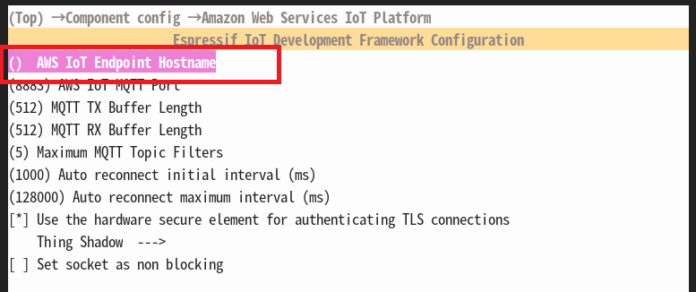

# AWS IoT EduKit — Smart CO2 Monitor

 This is the corresponding code for AWS IoT EduKit's [Smart CO2 Monitor](https://www.hackster.io/mongonta555/system-to-measure-co2-and-encourage-ventilation-6d3ccc). This code is made to work exclusively with the M5Stack Core2 ESP32 IoT Development Kit for AWS IoT EduKit available on [Amazon.com](https://www.amazon.com/dp/B08VGRZYJR) or on the [M5Stack store](https://m5stack.com/products/m5stack-core2-esp32-iot-development-kit-for-aws-iot-edukit).

# Requirement

- M5Stack Core2 for AWSIot EduKit
- MH-Z19C
- SwitchBot Contact Sensor
- SwitchBot Hub Mini

## misc
- AWS Account
  - AWS IoT
  - AWS Lambda
- Amazon Developer Services Account
  - Alexa Skills Kit

# Setup
This repository is available in the VSCode+PlatformIO environment.

``` git clone https://github.com/mongonta0716/M5Core2AWS_CO2_Monitor ```

# menuconfig
Open the folder that you git cloned from VSCode, open "New Terminal" in PlatformIO, and execute the following command.VSCode+PlatformIO
``` pio run --evcironment core2foraws -target menuconfig ```

## Modifications


- AWS IoT EduKit Configuration<br>
  - WiFi SSID
  - WiFi Password

- Component config
  - Amazon Web Services IoT Platform<br>
    - AWS IoT Endpoint Hostname
  - Core2 for AWS hardware enable<br>
    - Screen touch-FT6336U
    - Speaker-NS4168
    - SDcard
    - Expansion Ports A, B, C
  - OAP MH-Z19 CO2 Sensor<br>Specify the GPIO of M5Stack Core2 for AWS. RX->14, TX->13 for Port.C(blue)<br>
    - RX gpio<br> -> MH-Z19C's RX
    - TX gpio<br> -> MH-Z19C's TX
 
# Build

``` pio run --environment core2foraws --target upload monitor ```

# Usage

Please refer to the following links for usage and AWS and other settings.

[System to measure CO2 and encourage ventilation](https://www.hackster.io/mongonta555/system-to-measure-co2-and-encourage-ventilation-6d3ccc)

# LICENSE
- main: [GPL3.0](LISENCE)
- Base example: [Apache 2.0](https://github.com/m5stack/Core2-for-AWS-IoT-EduKit/blob/master/Smart-Thermostat/LICENSE)<br> Smart-Thermostat of [Core2-for-AWS-IoT-EduKit](https://github.com/m5stack/Core2-for-AWS-IoT-EduKit)
- [components/mhz19](components/mhz19): [GPL3.0](https://github.com/baycom/sensor-esp32/blob/master/LICENSE)<br>
I arranged and incorporated only the MH-Z19C part, referring to the repository of [OpenAirProject](https://github.com/baycom/sensor-esp32)


